# Predicción de Primas de Seguro con MLOps

<p align="center">
  <a href="https://github.com/fertueros/insurance-mlops/releases"></a>
  <a href="https://dagshub.com/fertueros/insurance-mlops"></a>
  <a href="https://dagshub.com/fertueros/insurance-mlops.mlflow"></a>
  
  
  
</p>

Este proyecto desarrolla un **pipeline de ML reproducible** para predecir el monto de las **primas de seguro**. Incluye **versionado de datos** (DVC), **feature store** (Feast), **tracking/registry** (MLflow en DagsHub), **tuning** (Optuna) y un **ensamble Stacking** (HGB + XGB + LGBM).

---

## 📝 1) Problema y Objetivo de ML

**Contexto:** El *pricing* de primas equilibra riesgo y competitividad.
**Objetivo:** Modelo de **regresión** para `Premium Amount`, evaluado con **RMSLE**, métrica robusta ante distribuciones sesgadas.

---

## 🌊 2) Diagrama del Flujo (DVC)

El pipeline se orquesta con DVC y se visualiza como **DAG**. Aqui un resumen del mismo.

```mermaid
graph TD
    subgraph "Preparación de Datos"
        A[Datos Crudos .csv] --> B{Preprocesamiento};
        B --> C[Datos Procesados .parquet];
        C --> D{Construcción de Set de Feast};
        D --> E[Set de Entrenamiento .parquet];
    end

    subgraph "Optimización y Entrenamiento"
        E --> F{Búsqueda de Hiperparámetros};
        F --> G[Mejores Parámetros .json];
        E --> H{Entrenamiento del Stacking};
        G --> H;
        H --> I[Métricas de CV];
        H --> J[Modelo Ensamblado .joblib];
    end
    
    subgraph "Predicción y Registro"
        K[Datos de Test .csv] --> L{Predicción en Test};
        J --> L;
        L --> M[Archivo de Submission .csv];
        J --> N{Registro del Modelo};
        N --> O[MLflow Model Registry];
    end
```



> `dvc dag` genera el grafo de dependencias del pipeline (stages ↔ deps/outs). Para exportar imagen: `dvc dag --full --dot > docs/pipeline.dot && dot -Tpng docs/pipeline.dot -o docs/pipeline.png`.

---

## 📊 3) Dataset

Dataset sintético de predicción de primas con \~20 columnas (numéricas, categóricas, fecha y texto corto).

#### ➡️ **[📄 Ver el Diccionario de Datos Completo](docs/DATA_DICTIONARY.md)**

* **Notas:** columnas con *missing*, *skew* y tipos erróneos; se corrigen en `src/clean.py`/`src/features.py`.

> **Test sin etiquetas:** `data/raw/test.csv` no contiene `Premium Amount`. Por tanto, el rendimiento se reporta con **validación cruzada (CV/OOF)**; el paso `predict_test` solo genera `id,y_pred`.

---

## ⚙️ 4) Instalación y Reproducción

### Requisitos

* Python **3.11+**, Git y DVC. (Graphviz opcional para renderizar el DAG)
* Cuenta DagsHub para Tracking/Registry (ya configurado en este repo).

```bash
# 1) Entorno
uv venv .venv
source .venv/bin/activate
uv pip install -U pip wheel
uv pip install -r requirements.txt

# 2) Variables de entorno (MLflow en DagsHub)
export MLFLOW_TRACKING_URI="https://dagshub.com/fertueros/insurance-mlops.mlflow"
export MLFLOW_TRACKING_USERNAME="<tu_usuario>"
export MLFLOW_TRACKING_PASSWORD="<tu_token>"
# (o usa DAGSHUB_USER / DAGSHUB_TOKEN)

# 3) Traer datos/artefactos versionados
dvc pull

# 4) Pipeline completo (etapas principales)
# Preprocesamiento + set de entrenamiento via Feast
dvc repro preprocess
dvc repro feast_build

# (Opcional) Tuning por modelo con Optuna
dvc repro tune_hgb
dvc repro tune_xgb
dvc repro tune_lgbm

# Entrenamiento + Stacking (OOF -> meta RidgeCV)
dvc repro train

# Predicción en test (sin labels)
dvc repro predict_test

# Registro del modelo en MLflow Model Registry (DagsHub)
dvc repro register_model

# Subir artefactos de DVC a remoto
dvc push
```

---

## 🧱 5) Estructura del Repositorio (resumen)

```
├── data/               # DVC-managed (raw/ processed/ feast/)
├── feature_repo/       # Feast repo (feature_store.yaml, features.py, data_sources.py)
├── models/             # stacking_ensemble.joblib (salida de train)
├── notebooks/          # 01_eda, 02_preproceso, 03_feast_inicio, 04_CV, 05_Optuna, 06_Comparativa_modelos, 07_Analisis_de_errores
├── reports/            # figures, predictions_test.csv.
├── scripts/            # build_training_set.py, predict_test.py, register_model.py
├── src/                # clean.py, features.py, train.py, tune.py, splits.py, mlflow_setup.py, models.py
├── dvc.yaml            # stages del pipeline
├── docs/               # DATA_DICTIONARY.md, MODEL_CARD.md
├── CHANGELOG.md        # Keep a Changelog + SemVer
└── pyproject.toml      # versión del paquete
```

---

## 📈 6) Resultados y Métricas

**Topline (5-fold RMSLE):**

* **Stacking (HGB + XGB + LGBM):** **1.1289**

> Métricas por modelo base, curvas de Optuna y detalles de OOF/CV están disponibles en MLflow (DagsHub):
> • **Tracking UI:** [https://dagshub.com/fertueros/insurance-mlops.mlflow](https://dagshub.com/fertueros/insurance-mlops.mlflow)
> • **Repositorio & artefactos:** [https://dagshub.com/fertueros/insurance-mlops](https://dagshub.com/fertueros/insurance-mlops)

> **Nota:** El conjunto `test.csv` no tiene `target`, por lo que no hay métrica de test en este proyecto. Todas las conclusiones de desempeño se basan en la validación cruzada y las predicciones OOF del pipeline.

---

## 🤝 7) Stacking y Tuning

* **Tuning:** Optuna para HGB/XGB/LGBM; mejores hiperparámetros guardados en `artifacts/optuna/*_best_params.json`.
* **Stacking:** OOF de cada modelo base (CV=5) → meta-modelo `RidgeCV` entrenado sobre OOF → *refit* final de bases en todo el train.

---

## 🧩 8) Feature Store (Feast)

Se usa **Feast** para garantizar **consistencia temporal** mediante `get_historical_features` (join *point-in-time*):

* **Entity:** `id`
* **Timestamp:** `event_timestamp`
* **Offline store:** Parquet local

Definiciones en `feature_repo/` y stage `feast_build` para generar `data/feast/training_set.parquet`.

---

## 🏷️ 9) Model Registry (MLflow/DagsHub)

El ensamble se registra como **PyFunc** en el **Model Registry**:

```python
from mlflow.tracking import MlflowClient
client = MlflowClient()
# Asignar alias (opcional, sustituyen stages a futuro)
client.set_registered_model_alias("insurance-premium-stacking", "champion", 1)
# Cargar por alias:
# mlflow.pyfunc.load_model("models:/insurance-premium-stacking@champion")
```

> UI del Registry y experimentos en DagsHub:
> [https://dagshub.com/fertueros/insurance-mlops.mlflow](https://dagshub.com/fertueros/insurance-mlops.mlflow)

---

## 📓 10) Notebooks

* `01_eda.ipynb`: calidad de datos, missingness, distribución de `Premium Amount`.
* `02_preproceso.ipynb`: demostración de limpieza/FE.
* `03_feast_inicio.ipynb`: *point-in-time join* y training set con Feast.
* `04_CV.ipynb`: verificación de folds/balance.
* `05_Optuna.ipynb`: historia de optimización e importancias.
* `06_Comparativa_modelos.ipynb`: comparación de modelos base (CV).
* `07_Analisis_de_errores.ipynb`: análisis de error y segmentos.
* `08_Interpretabilidad.ipynb`:
  - Importancia global de variables vía *Permutation Importance* (RMSLE).
  - Gráficos PDP + ICE sobre el modelo base HGB.
  - Explicaciones globales y locales con **SHAP**.

* `09_Fairness.ipynb`:
  - Evaluación de MAE y RMSLE por género, estado civil y grupos de edad usando **Fairlearn / MetricFrame**.
  - Análisis de tasas de “prima alta” por grupo (paridad demográfica aproximada).
  - Ejemplos de explicaciones contrafactuales con **DiCE**, manteniendo fijos edad y género.

* `10_Monitoreo.ipynb`:
  - Construcción de datasets de referencia y escenarios actuales (baseline vs drift simulado).
  - Reportes de **data drift** y **performance de regresión** con **Evidently**.
  - Análisis del impacto del drift en variables clave y en la calidad del modelo.


---

## 🌿 11) Versionado, Ramas y Releases

* **SemVer 2.0.0** y **Keep a Changelog**.
* Ramas: `main` (estable), `develop` (integración), `feature/*` (PRs hacia `develop`).

**Checklist de release**

1. Actualizar `pyproject.toml` → `version = "X.Y.Z"`
2. Actualizar `CHANGELOG.md` (`[X.Y.Z] - YYYY-MM-DD`)
3. PR `release/X.Y.Z` → `main`, merge
4. Tag: `git tag vX.Y.Z && git push origin vX.Y.Z`
5. Crear **GitHub Release** con notas y enlaces a MLflow/DagsHub

---

## 📜 12) Licencia, Contribución, Contacto

* **Licencia:** ver [`LICENSE`](LICENSE).
* **Contribución:** PRs bienvenidos. Estándar de ramas: `feature/*`, `chore/*` (merge a `develop`).
